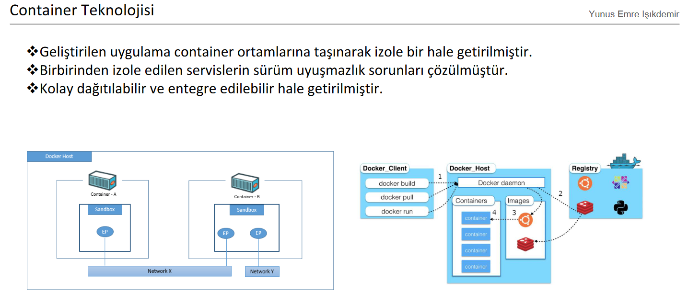

### MIUULFLIX

The primary objective of this study was to develop an end-to-end machine learning-based web application and deploy it on Amazon Web Services (AWS), while ensuring its security.

<b>Application Demo</b>: <a href="https://youtu.be/oniCY-gwxAc">Link</a> 
<b>Backend Demo</b>: <a href="https://youtu.be/tFG1jJXDjcA">Link</a>

  

 

### Utilized technologies in this investigation

The technologies used in this study encompass a wide range of tools and solutions. For user interface design, Reactjs, HTML, and CSS were employed. Nodejs and JavaScript were utilized for CRUD operations and user authentication. Python was leveraged for recommendation systems, and Redux was applied for context management. FastAPI was used to enable HTTP requests for the recommendation system. PostgreSQL served as the relational database, and Docker was used for virtualization and deployment. Integration and external access were achieved through AWS cloud services, with EC2 as the server and Lambda for server status management. Networking was established for communication between applications and services. Shell scripting was used for server start-up configuration, while web scraping was employed to gather movie images. Postman was used to test HTTP requests, and JWT and Cookies were used for security and permissions. Finally, Route53 was used for DNS.

  

 

### Frontend Design Specifications

The user interface was designed using Reactjs, HTML, and CSS technologies. Once the user successfully logs in, they can select the most appropriate movie from the selection screen and proceed. Based on this choice, a personalized movie list is displayed on the homepage of the designed movie site.

  

### Backend Design Specifications

The server-side has been designed using Node.js and FastAPI, and integrated with the user interface. CRUD operations have been performed in JavaScript using Node.js framework, enabling access to film and user information through this service. Additionally, a recommendation system has been developed in Python using FastAPI framework, which provides personalized movie recommendations to the user based on their selection. The system does not allow access to the content without user authentication.

  

### Database Management

The PostgreSQL relational database has been utilized to store data. To increase the security of user information, passwords are stored after being passed through a hash function. Films are kept in a separate table, and filtering is performed based on their genres using the movies table. The Votes table contains the IDs of the movies that each user has liked, and it is used when recommending movies.

  

### Containerization

The developed application has been made isolated by moving it to container environments. The problem of version conflicts among isolated services has been resolved. It has been made easily distributable and integratable.

  

### Cloud Network Configuration

The system has been set up on the North Virginia region using Amazon Web Services. A private subnet has been created for the Relational Database Systems (RDS) service. A public subnet has been created in the network structure where the server will be installed. The server is managed and controlled with Lambda service.

  

### Cloud Server Setup and Application Deployment

The server is configured on the public network to allow for interaction with the real world, while the database is set up in a private network to enhance security. The hardware requirements of the application are determined and taken into consideration during the server setup process.

  

### User Role Permission

In this study, Identity Access Management (IAM) was implemented to manage access and permissions to various resources in the system. Permissions and access levels were defined to control user access to sensitive data and applications. Users, groups, and roles were created to ensure that access was granted only to authorized personnel. Additionally, appropriate policies were defined to ensure secure interactions between services. The implementation of IAM ensured that resources were protected from unauthorized access, and access control was effectively managed for the system.

  

